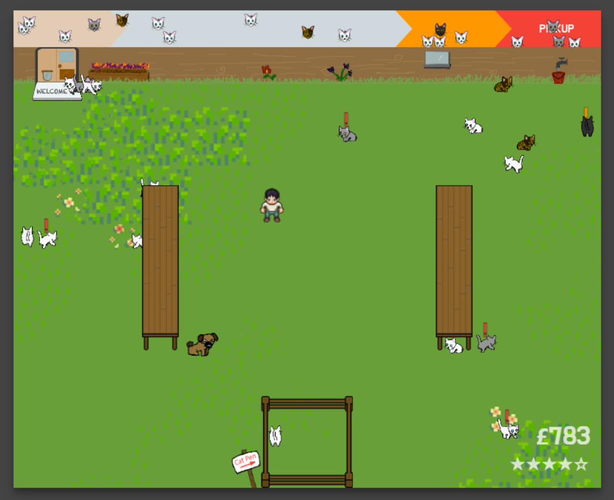

# Herding Cats

> Team entry to [GMTK Game Jam 2020](https://itch.io/jam/gmtk-2020)

*Herding Cats* is game about the day-to-day challenge of running a cattery.

Cats will be periodically dropped off, and must be herded into the pen before their owners come to pick them up.

Keep too many owners waiting, and your ratings will plummet!

**[Click here to play online](https://danjb1.itch.io/herding-cats)**

## Build & Run

1. Install npm
1. Run `npm i` to install dependancies
1. Run `npm run start` to start the local server
1. Open http://localhost:6543/ to view the game

## Packaging for itch.io

1. Run `npm run build`
1. Copy `index.html` to `dist`
1. Copy `styles.css` to `dist`
1. Copy `images/ui` to `dist/images`
1. Copy `images/cat-bg.png` to `dist/images`
1. Copy `images/sprites.json` to `dist/images`
1. Copy `images/sprites.png` to `dist/images`
1. Copy `sounds` to `dist`
1. Zip up the contents of the `dist` folder

## Credits

 - [Danjb1](https://github.com/Danjb1)
 - [esummers1](https://github.com/esummers1)
 - [m-mizen](https://github.com/m-mizen)
 - [DanStevens](https://github.com/DanStevens)
 - [matt4321](https://github.com/matt4321)
 - [aonghas](https://github.com/aonghas)
